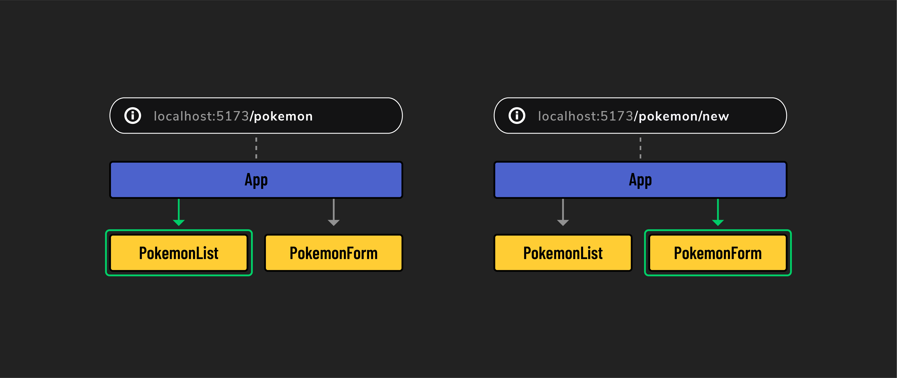

# React Router DOM

React Router is a library that enables client-side routing in React applications. With React Router, users can experience all of the benefits of a SPA, along with the expected navigational aspects of traditional websites.

